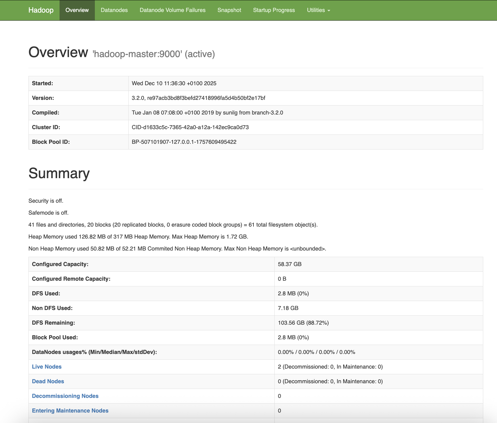
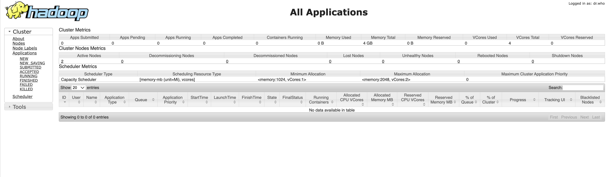
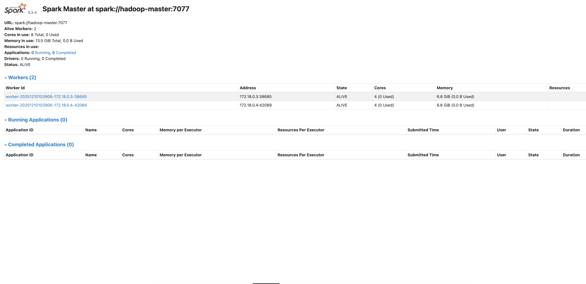

## 📋 Objectif
Mise en place d'un cluster Big Data complet avec Docker, incluant :
- **Hadoop HDFS** pour le stockage distribué
- **YARN** pour la gestion des ressources
- **Spark** pour le traitement distribué

## 📸 Résultats obtenus

### 1. Interface Hadoop HDFS

*Interface web du NameNode montrant le système de fichiers HDFS*

### 2. Interface YARN ResourceManager  

*YARN gérant l'allocation des ressources sur le cluster*

### 3. Interface Spark Master

*Spark Master avec les workers connectés et jobs en cours*

## 🏗️ Architecture déployée
┌─────────────────────────────────────┐
│ Cluster Docker │
├─────────────────────────────────────┤
│ ┌──────────┐ ┌──────────┐ │
│ │ Hadoop │ │ YARN │ │
│ │ NameNode │ │ Resource │ │
│ │ Port │ │ Manager │ │
│ │ 9870 │ │ 8088 │ │
│ └──────────┘ └──────────┘ │
│ │ │ │
│ ┌──────┴─────┐ ┌─────┴──────┐ │
│ │ Spark │ │ Node │ │
│ │ Master │ │ Managers │ │
│ │ 8080 │ │ (Workers) │ │
│ └────────────┘ └────────────┘ │
└─────────────────────────────────────┘

text

## 🔧 Travail réalisé

### Phase 1 : Installation Docker
```bash
# Configuration du cluster avec docker-compose
docker-compose up -d
Services déployés :

✅ Hadoop NameNode (HDFS)

✅ YARN ResourceManager

✅ Spark Master

✅ 2x Spark Workers / YARN NodeManagers

✅ 2x Hadoop DataNodes

Phase 2 : Configuration
Hadoop : Configuration HDFS avec réplication (facteur 2)

YARN : Allocation mémoire (4GB total) et CPU

Spark : Intégration avec YARN comme master

Réseau : Communication entre conteneurs Docker

Phase 3 : Validation
✅ Accès aux 3 interfaces web

✅ Connexion entre tous les services

✅ Soumission de jobs Spark réussie

✅ Stockage HDFS fonctionnel

📊 Commandes exécutées
bash
# 1. Démarrer le cluster
docker-compose up -d

# 2. Vérifier l'état des services
docker-compose ps

# 3. Tester Hadoop
hdfs dfsadmin -report

# 4. Tester YARN
yarn node -list

# 5. Soumettre un job Spark
spark-submit --master yarn --deploy-mode cluster app.py

# 6. Accéder aux interfaces
# Hadoop : http://localhost:9870
# YARN   : http://localhost:8088  
# Spark  : http://localhost:8080
📁 Structure du projet
text
TP_BIGDATA_FINAL/
├── README.md              # Documentation principale
├── docker-compose.yml     # Configuration du cluster
├── spark-defaults.conf    # Configuration Spark
├── screenshots/           # Captures d'écran
│   ├── hadoop/hadoop.png
│   ├── yarn/Yarn.png
│   └── spark/Spark.png
├── notebooks/             # Notebooks d'analyse
├── data/                  # Jeux de données
├── scripts/               # Scripts utilitaires
└── docker_config/         # Fichiers de config avancés
✅ Validation technique
Service	Port	Statut	Commentaire
Hadoop HDFS	9870	✅ OK	NameNode accessible
YARN RM	8088	✅ OK	ResourceManager actif
Spark Master	8080	✅ OK	Master avec 2 workers
Spark History	18080	✅ OK	Historique des jobs
Hadoop DataNodes	9864	✅ OK	2 nodes connectés
Paramètres de configuration :

Mémoire totale : 4 GB RAM

Cœurs CPU : 4

Stockage HDFS : 100 GB (répliqué x2)

Réplication HDFS : facteur 2

🎓 Apprentissages
Technique
Orchestration Docker : Gestion multi-conteneurs avec docker-compose

Architecture Hadoop : Interaction HDFS + YARN

Spark on YARN : Exécution de jobs Spark via YARN

Monitoring : Utilisation des interfaces web pour le suivi

Pratique
Configuration réseau entre conteneurs

Allocation dynamique des ressources

Gestion des volumes persistants

Débogage des services distribués

👨‍💻 Auteur
Youssef Bentaher
Étudiant en Big Data
Année universitaire 2025/2026

Ce TP a été réalisé dans le cadre du cours de Big Data.
L'ensemble du code et des configurations est disponible sous licence MIT.
